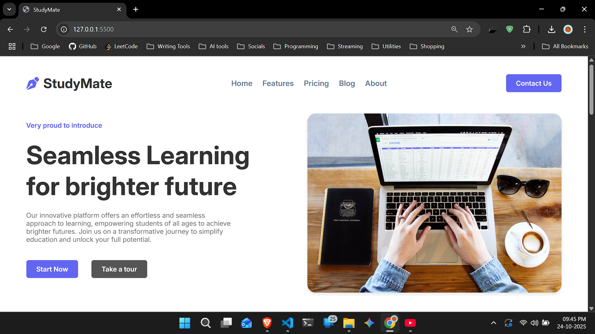
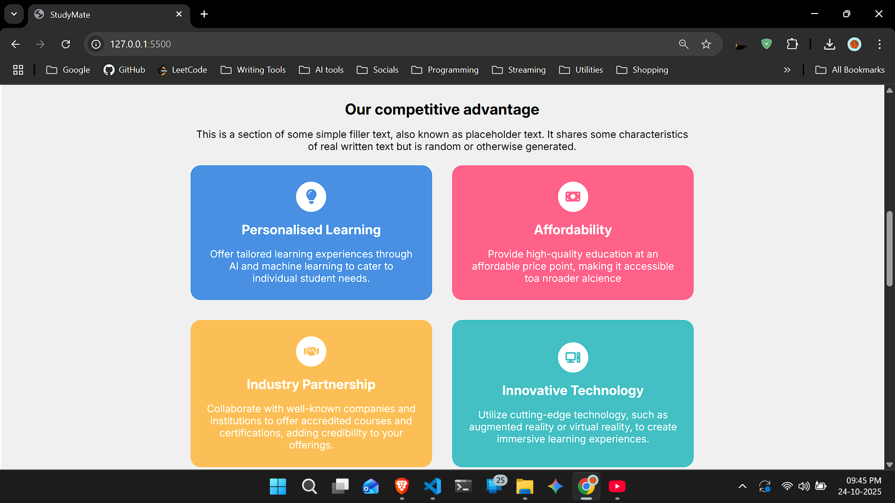
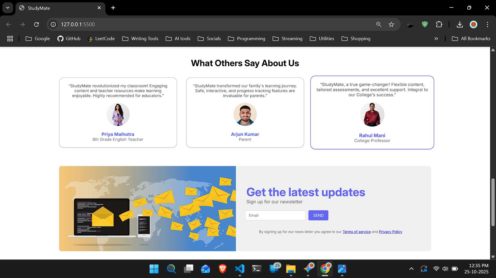
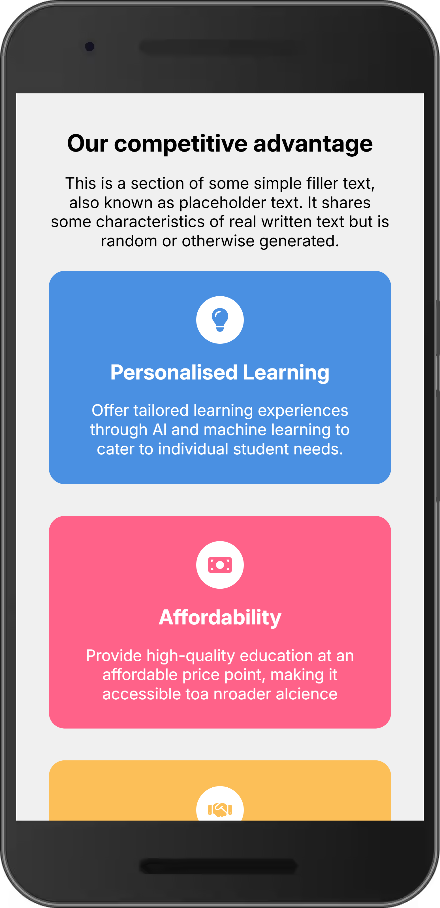
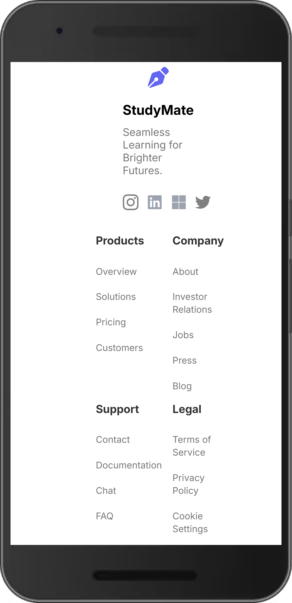

## StudyMate — Responsive Landing Page

A lightweight, responsive static website (HTML/CSS/JS) called "StudyMate".

This repository contains a simple landing page demonstrating a responsive layout with a hamburger menu for small screens, feature cards, testimonials, and a newsletter section.

Files of note
- `index.html` — main page
- `style.css` — styles and responsive rules
- `script.js` — small JS to toggle the mobile navigation
- `screenshots/desktop.svg` — placeholder screenshot for desktop view
- `screenshots/mobile.svg` — placeholder screenshot for mobile/phone view

How to view locally

Option 1 — Open directly
1. From your file explorer, double-click `index.html` to open it in your default browser.

Option 2 — Simple local server (recommended for consistent assets)
Run this in PowerShell inside the project folder:

```powershell
python -m http.server 8000
# then open http://localhost:8000 in your browser
```

Screenshots

Desktop views :





Mobile / Phone views :






Notes about screenshots
- The images in `screenshots/` are simple placeholders (SVG) included so the README demonstrates how screenshots will appear.
- To use real screenshots, replace the files in `screenshots/` (for example `screenshots/desktop.png` and `screenshots/mobile.png`) and update the paths in this README if needed.

Project structure

```
index.html
style.css
script.js
images/          # project icons and images used by the page
screenshots/     # README screenshots 
```


License & credits

Provided as-is for demo / educational purposes.

